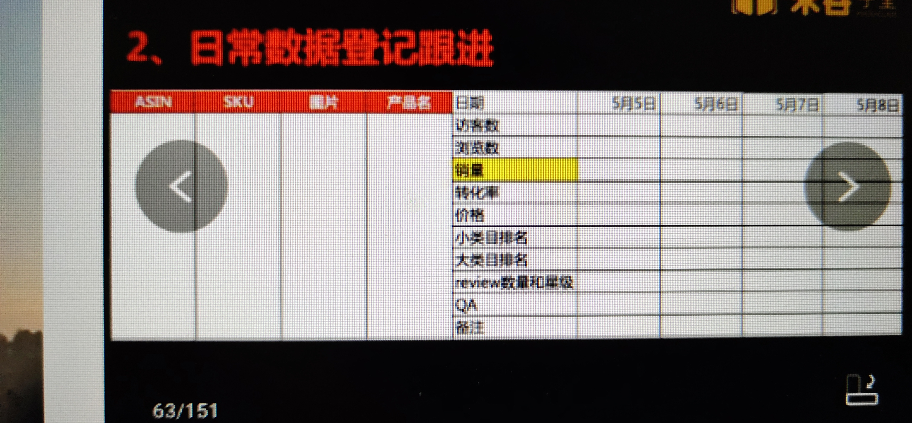
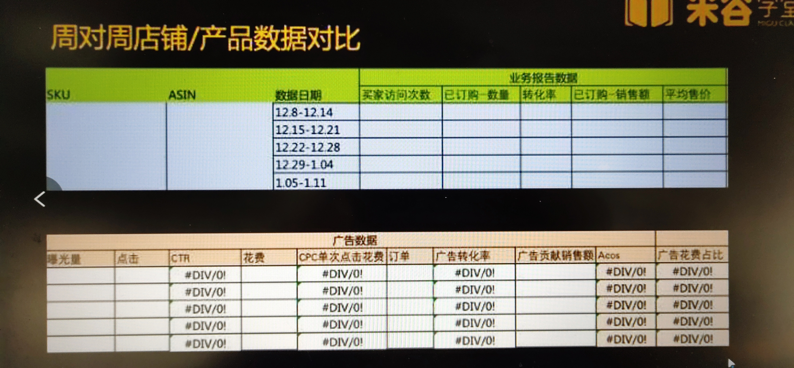

##### 防疫用品开卖先搞定`类目审核`
1. 产品审核两道关： 海关和平台关
	+ 类目审核：是否能卖这个产品---服务商可以做
	+ 产品审核：先问平台客服
2. FDA认证是什么？
3. CE认证是什么？
4. Niosh是什么？
5. BSI是什么？
6. PMDA是什么？
##### 快速选品
1. 重点关注前十
2. 每个小时去看或隔几个小时看还能再榜单上的可以学习参考
3. 6个月以内评价、数量在100以内就冲上前100的
4. 核算产品的毛利润和毛利润
	+ 毛利润：不包括推广费用
		- 空运毛利：25%个点以上
		- 海运毛利：35%个点以上
##### 如何判断现象级爆款该不该切入
1. 市场容量、趋势
2. 市场竞争度
3. 利润
+ google trends
	- 趋势线：0-25是比较低迷的，25-50表示稍微有点搜索量了，50-75是比较热的一个状态，75-100巅峰状态
##### 测款
> 四个维度
1. 销量
2. 质量
	+ 国家、习惯角度的质量标准不同
	+ 运输过程中的质量保证
3. 利润
4. 竞争度
	1. 关键词的竞价
5. 产品成本、头程物流、亚马逊配送费、仓储费、佣金、退货额、推广费、税金以及汇损失
	+ 产品成本：厂家生产成本
	+ 头程物流：中国到目的销售国仓库的物流费用
	+ 亚马逊配送费：目的国仓库到买家手中的物流配送费
	+ 仓储费：每月存储在亚马逊仓库的费用
	+ 佣金：不同类目佣金费率不同，6%~15%
	+ 退货额：产品退货所产生的损失费用，不同产品比例不同
	+ 推广费：站内外推广成本
	+ 税金以及汇损：目的国进口关税以及提现到国内的汇损
6. 日常数据登记跟进

7. 测款成功的标准
	+ 流量/买家访问次数递进明显（破10 20 30）
	+ 点击率> 0.3% 自动广告3天出单
	+ 小类目/大类目的排名趋势向上，销量上升，不同款式销量区别
	+ 对于送测的产品，自然单的比例7天后会上升
	+ 前50/100个订单有没有出现差评和退货具体原因
	+ 售价有利润空间

##### 知识产权
1. 常见的卖家的商标侵权情形
	+ listing标题关键词使用了别人的文字商标
	+ 产品本身或者外包装图上带有别人的文字商标或者图形商标
	+ 产品使用说明书等带有别人的文字商标
	+ 后台设置了或是广告搜索词引用了别人的文字商标
2. 版权侵权
	+ 产品图片或外包装图片盗用了别人的
	+ 产品本身或外包装带有别人拥有版权的卡通形象
	+ 产品说明或描述文案摘抄了别人的
	> 如何查询一张图片的来源
	+ counterfeit.Technology

##### 运营中后期

1. 流量 * 转化率 * 客单价 = 销售额
	+ 流量： 曝光 * 点击率
2. 翻新链接
	+ 记录要翻新的链接sku、upc、ASIN
	+ 删除要翻新的链接
	+ `24小时后`用批量表格，同样的sku、upc、ASIN重新上传链接
##### 新品扶持期
1. 从前台可售开始计算
2. 后台上传链接时数量填0，状态变为不可售缺货状态避免采坑
3. 通过后台开售时间的调整避开一周的流量低峰，数据报告-业务报告
4. 新品推广8种打法
	+ 纯广告推广
	+ 螺旋式打法
	+ 巨额优惠券+自动
	+ 限时限量+手动
	+ Prime专享折扣+自动+手动
	+ 社交媒体促销代码+自动
	+ 义乌系打法
	+ 莆田系打法

##### 新品从破单到稳定销量打法技巧梳理
1. 把握新品扶持期
2. 选择合适的类目节点
	+ 季节性产品
	+ 非季节性产品
3. 寻找产品的类目节点
	+ 关键词第一、二页的参考
	+ Amazon Chioce  转化率最高
	+ Best Seller  综合评价高